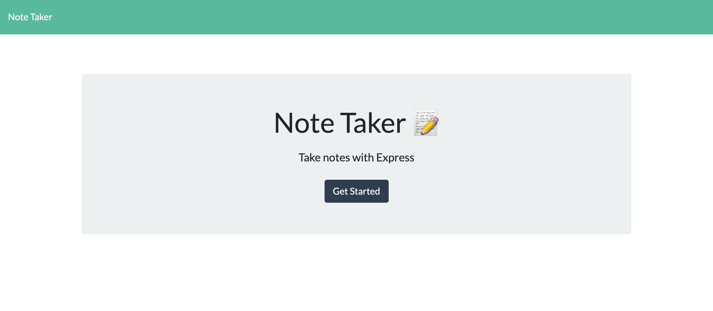
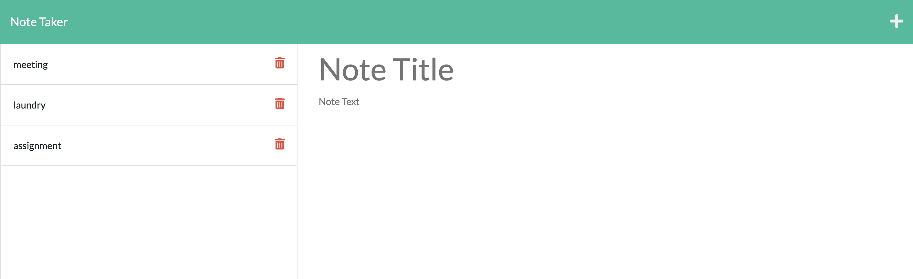

# Note-taker

## Technology Used 

| Technology Used         | Resource URL           | 
| ------------- |:-------------:| 
| nodeJs | [https://nodejs.org/docs/latest-v16.x/api/](https://nodejs.org/docs/latest-v16.x/api/)     |   
| ExpressJs | [https://expressjs.com/en/5x/api.html](https://expressjs.com/en/5x/api.html)     |   
| Heroku | [https://devcenter.heroku.com/categories/reference](https://devcenter.heroku.com/categories/reference)     |   

 

## Description 

This application is used for saving day to day tasks as note taker. Users can add/view/delete notes from the list of notes. This is built using HTML, CSS, JS on the front-end and nodeJs/expressJs as backend. This application is deployed using Heroku.

 

## Usage 

Welcome Page using '/api' as api endpoint.

 

 

Users can list of notes available /api/notes as endpoint and users can click on '+' button to add new note and click on save button to save it to db. users can delete notes using delete button

 

 

## Learning Points 

* using expressJs on the backend
* REST API implementation
* using express modular routing

 

## Links

Github Repo - https://github.com/srinithi19/Note-taker  
Application URL - https://srinithi19.github.io/Note-taker/
